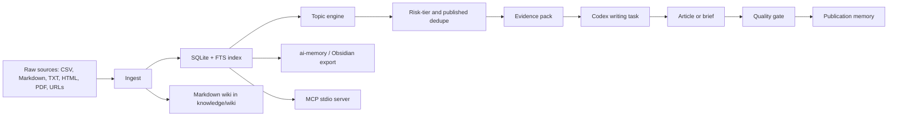

# System Architecture

## Pipeline

## Core modules

- `article_factory.ingest` - reads source files and URLs, chunks text, extracts semantic clusters.
- `article_factory.db` - SQLite schema, FTS search, topic and publication tables.
- `article_factory.topics` - turns semantic clusters and curated cluster maps into article ideas.
- `article_factory.generator` - builds evidence packs, prompts, briefs, and LLM drafts.
- `article_factory.codex_task` - prepares Codex-only writing tasks without external LLM APIs.
- `article_factory.quality` - checks generated articles against structure and risk rules.
- `article_factory.ai_memory` - exports a compact wiki snapshot for external memory systems.
- `article_factory.mcp_server` - exposes status, search, topic selection, draft generation, and memory export as MCP tools.
- `article_factory.doctor` - checks local providers, Docker, Ollama, OpenAI key, and optional PDF support.

## Operating model

1. Put sources into the workspace.
2. Run `python -m article_factory prepare --spec "..." --count N --game dota2 --language en`.
3. Codex opens `CURRENT_CODEX_TASK.md`, reads prompts/evidence, and writes the articles.
4. Run `review` on the generation manifest.
5. Publish manually after review.
6. Add published URLs to `published/articles.csv`.

## Universal domain model

The code treats `dota2` and `cs2` as current domains, not the only possible domains. Unknown future CSVs are assigned to `general` unless a file name or headers allow detection. Commands accept arbitrary `--game` values, so future domain-specific importers can be added without changing the article pipeline.
