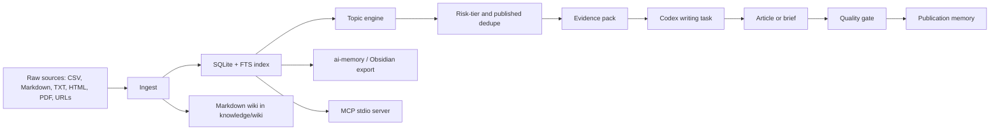

## Pipeline

```mermaid
flowchart LR
  A["Raw sources: CSV, Markdown, TXT, HTML, PDF, URLs"] --> B["Ingest"]
  B --> C["SQLite + FTS index"]
  B --> D["Markdown wiki in knowledge/wiki"]
  C --> E["Topic engine"]
  E --> F["Risk-tier and published dedupe"]
  F --> G["Evidence pack"]
  G --> H["Codex writing task"]
  H --> I["Article or brief"]
  I --> J["Quality gate"]
  J --> K["Publication memory"]
  C --> L["ai-memory / Obsidian export"]
  C --> M["MCP stdio server"]
```
