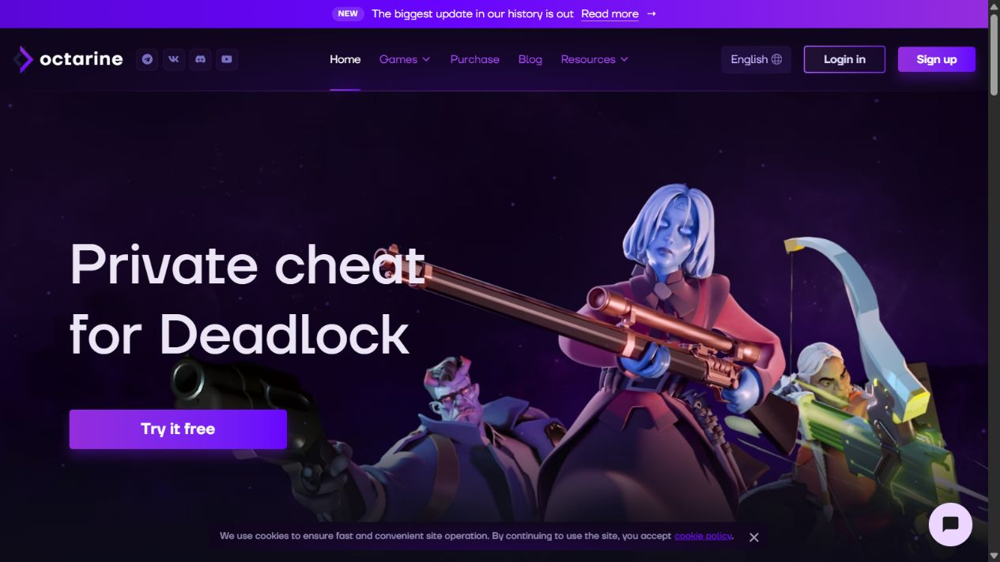
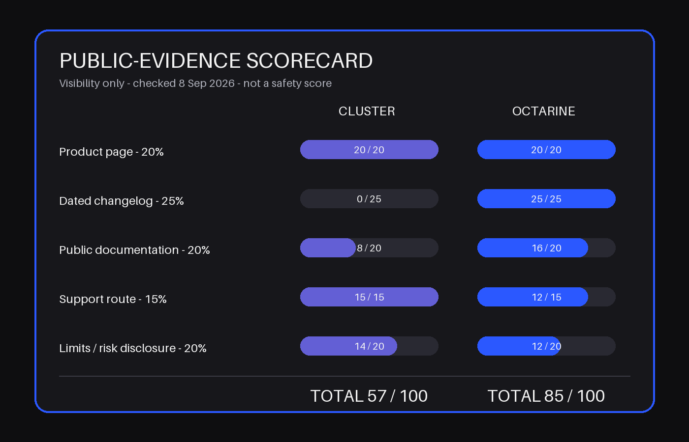

# Cluster vs Octarine for Deadlock: Which Model Fits?

*Published and evidence checked: September 8, 2026 · By the CheatsGaming Editorial Team*

One reader opens two Deadlock product pages and gets two very different homework assignments. Cluster gives a short buying page: a compact function list, system requirements, plan lengths, a trial answer, and a support link. Octarine gives a game page, a public blog, a cloud-config explainer, social channels, and a link to technical documentation. What looked like a feature comparison turns into a research-style decision.

That is the useful angle in this **Cluster vs Octarine Deadlock** comparison. The question is not which vendor can print the longest list or the boldest protection claim. It is whether you want a focused game-specific offer that is quick to inspect, or a broader platform whose public trail rewards deeper reading and more frequent rechecking.

> **Editorial disclosure:** Cluster is the linked product in this article. That relationship does not make its vendor claims independent facts. Both products are judged by the same public-evidence method, and neither was tested for detection outcomes, support quality, or long-term compatibility.

> **Quick answer:** Cluster is easier to scan as a compact Deadlock offer. Octarine publishes a deeper public trail and more platform context. On evidence visibility alone, Octarine leads because it has dated updates and multiple public explainers. Cluster is the cleaner fit for a reader who wants a small decision surface and a direct support route. Neither page proves safety, future uptime, or how well every advertised function behaves in a live match.

## What each product page is trying to help you decide

Cluster's current page is built around one immediate decision: does this Deadlock package cover the categories, operating system, access period, and support route I need? On September 8, it loaded at its self-canonical URL and listed Windows 10/11 64-bit support, Intel and AMD processors, four duration choices, a three-day trial for eligible new accounts, and Telegram support.

Its named categories include aim assistance, visual information, hero combinations, parry-related automation, Souls assistance, a humanizer category, field-of-view controls, and a dodger. The descriptions are short. That is useful when the reader wants orientation, but it leaves fewer public details to audit later.

Octarine's page makes a wider pitch. It presents a Deadlock-specific product while also positioning the account as part of a multi-game platform. The page links to a public blog, a cloud-config explainer, community channels, and an API documentation host. It also describes more granular hero, visual, preview, theme, notification, and configuration ideas.

The difference is editorial, not just commercial. Cluster asks, “Does this compact package cover my shortlist?” Octarine asks, “Do I want to investigate and maintain a larger system?” That second model can be a strength for curious buyers and a chore for anyone who just wants a clear yes-or-no page.

<!-- IMAGE_SLOT_01
Type: real screenshots
Placement: after the product-model explanation
Assets: assets/cluster-deadlock-header-2026-09-08.png and assets/octarine-deadlock-header-2026-09-08.png
Production note: Pair the current headers at equal visual width. Keep vendor names, URL labels, and the checked date outside the screenshots. Do not crop away access language or add safety badges.
-->

*Cluster vendor page, checked September 8, 2026. The capture shows the compact product and order presentation; protection wording remains a vendor claim.*

*Octarine vendor page, checked September 8, 2026. The header presents a game-specific page inside a broader product platform.*

## Aim, souls and visuals at category level

Both pages cover the familiar Deadlock buckets. Each advertises an aim layer, information overlays, wider-view or world-presentation controls, and automation tied to combat or movement. Octarine also describes predictive behavior, hero logic, finishers, previews, notifications, and more detailed visual states. Cluster stays closer to category names and short explanations.

That does not make every similarly named item equivalent. “Aim,” “ESP,” and “Souls” can describe different scopes, limits, defaults, and maintenance burdens. A public page can establish that a vendor currently claims a category; it cannot establish response quality, accuracy in every game state, or behavior after the next Deadlock update.

So compare at category level unless both vendors publish matching, current detail. A fair shortlist looks like this:

- **Aim and target categories:** both pages publicly name aim assistance. Octarine gives more narrative detail; Cluster gives a shorter summary.
- **Souls and lane information:** both tell the reader that Souls-related assistance exists, but the public descriptions are not a controlled test.
- **Visual awareness:** both describe hero or object information. Octarine exposes more examples and preview language; Cluster emphasizes configurable on-screen information.
- **World and camera presentation:** both mention wider-view or scene-customization categories. Those labels show scope, not quality.
- **Automation:** both advertise reaction or hero-related functions. This comparison stays at the product-model level and does not reproduce operational settings.

Raw feature count is a weak winner rule. A longer list may represent real depth, duplicated labels, narrow edge cases, or a larger maintenance surface. Public evidence becomes more valuable when it shows dates, limitations, and what changed—not merely that a label exists.

## Hero-specific tools versus a compact default setup

Octarine gives hero-specific logic a central role in its Deadlock story. Its page describes individual hero scenarios and its August update discusses a broad interface and renderer overhaul. That is attractive if you enjoy exploring a system, comparing modules, and revisiting settings as the product evolves.

Cluster presents a more compact default mental model. Its current page says the interface is designed for straightforward setup and lists a finite group of high-level functions. It does not require the reader to work through a large documentation tree before understanding the offer.

Neither philosophy is automatically better. More hero detail can help a researcher determine whether the public material addresses a specific character. It can also create more things that may need documentation, testing, and explanation after a game update. A compact offer is easier to audit at a glance, but it can leave the reader with more questions for support.

To compare the focused offer against the wider documentation set, inspect Cluster's current [deadlock cheat](https://cluster.center/en/deadlock) page and record what is live on the day you publish.

That “record what is live” step matters. Product pages change. A good comparison notes the date and preserves the distinction between what was visible, what the vendor claimed, and what remained unknown.

## Public docs, changelogs and update visibility

Octarine has the stronger dated trail. Its public blog index showed “BIG UPDATE” dated August 25, 2026 as the newest visible post. The post says the release covered all of its games and was available in Deadlock first, then names concrete changes around the interface, previews, themes, notifications, and other user-visible areas. A July 18 cloud-config post provides another dated platform artifact.

Cluster's current product page is readable, and its FAQ covers trial, operating systems, and support. During this check, however, no dated public Deadlock changelog comparable to Octarine's blog was found. That is not evidence that Cluster does not update. It means an outside reader has less dated material to audit without contacting the vendor.

Octarine does not get a perfect documentation score. Its product page linked an API documentation host, but that host closed the browser connection during the September 8 check. Its access language also needs reconciliation: a June 16 guide said Deadlock and CS2 were free at that time, while current product and catalog pages also present broader subscription language. Those statements may describe different dates or scopes. They do not justify quoting a current price without checking the live account flow.

### Public-evidence scorecard

This scorecard measures **visibility**, never safety or product performance. The weights are fixed before scoring: product page 20%, dated changelog 25%, public documentation 20%, support route 15%, and limitations/risk disclosure 20%.

- **Cluster — 57/100:** product page 20/20; dated changelog 0/25; public documentation 8/20; support route 15/15; limitations/risk disclosure 14/20.
- **Octarine — 85/100:** product page 20/20; dated changelog 25/25; public documentation 16/20; support route 12/15; limitations/risk disclosure 12/20.

Cluster receives full product-page and support-route credit because both are direct and readable. It loses dated-update points because none was found. Octarine earns the changelog score and most documentation points, but loses credit for the unavailable API host, conflicting access language, and a support path whose service level was not tested.

<!-- IMAGE_SLOT_02
Type: hand-built evidence graphic
Placement: immediately after the scorecard method
Asset: assets/public-evidence-scorecard-cluster-octarine-2026-09-08.png
Production note: Preserve the fixed weights, totals, checked date, and “not a safety score” label. Do not convert the totals into a product-quality ranking.
-->

*Method: product page 20%, dated changelog 25%, public documentation 20%, support route 15%, and limits/risk disclosure 20%. Checked September 8, 2026. The score measures evidence visibility only.*

There is a less obvious tradeoff here: more documentation creates maintenance work. A deep help system can become stale page by page. Product, guide, catalog, and account language may drift apart. Octarine deserves credit for publishing more material, but the reader still has to check which page is newest and whether the documentation matches the current product. Documentation depth is valuable only when dates and scope stay clear.

## Trial, subscription and support questions

Cluster's FAQ states that eligible new accounts receive a three-day trial and that a repeat trial cannot be activated across multiple accounts. Its page displays 7-, 30-, 90-, and 180-day choices, and the support route goes directly to a Telegram ticket bot. Those are observable page facts; response time and problem resolution were not tested.

Octarine offers “Try it free” language and describes support through public community routes. Its product page frames pricing as one subscription for all games, while the older getting-started guide describes Deadlock as free at that time. That mismatch should trigger questions, not arithmetic.

Before choosing either product, ask:

- Does the trial require a brand-new account, and when does its clock start?
- Does access cover Deadlock only or a multi-game account?
- Does unused time pause during maintenance?
- Which page or checkout screen is the current source of truth?
- Is support reachable before purchase, and are hours stated?
- What happens when a game update interrupts access?

Do not rely on an old review's quoted price. Currency, duration, promotions, and entitlement can change independently. Recheck the final account or checkout screen without completing a purchase, then save the date and exact scope you observed.

## The information both vendors leave unproven

Neither public site can prove future compatibility. A live page proves that the page loaded. A dated changelog proves that the vendor published a dated note. A support button proves that a route exists. None of those signals proves how quickly a future issue will be handled.

Protection language deserves the same restraint. Both vendors make claims about reducing detection risk. Those claims are not controlled, independent tests and should never decide the winner. Public material also leaves several practical unknowns:

- how often documented behavior differs from the current build;
- whether every named category works consistently across hardware and game states;
- how support handles reproducible problems;
- whether a trial exposes the same scope as paid access;
- how long a dated update remains relevant after later patches;
- what limitations are visible only after login.

The honest conclusion is not “both are equal.” It is that the evidence has different shapes. Octarine exposes more dated and descriptive material. Cluster exposes a simpler buying surface and a clearer direct support route. The unknowns remain real on both sides.

## Pick by research style and desired scope

Choose Cluster's model if you want to confirm a concise category list, Windows requirements, duration options, an eligible-user trial, and a support route without reading a large platform archive. Its strength is a compact, readable game-specific offer. Its main public-evidence weakness is the absence of a dated Deadlock update trail found during this review.

Choose Octarine's model if you value public release notes, platform explainers, cloud-configuration claims, and detailed Deadlock examples enough to maintain your own evidence ledger. Its strength is documentation depth. Its weakness is that deeper documentation creates reconciliation work, especially when an older guide and current commercial pages describe access differently.

If your decision depends on a specific hero or platform behavior, Octarine gives you more public material to interrogate. If it depends on a short, legible default package, Cluster is easier to inspect. In both cases, date your notes, treat claims as claims, and postpone the decision when the current page cannot answer a must-have question.

## FAQ

### Is Cluster or Octarine more focused on Deadlock?

Cluster presents the more compact game-specific offer. Octarine also has a Deadlock-specific page, but frames it inside a broader multi-game platform with more public product material.

### Which provider publishes a Deadlock changelog?

Octarine had a public dated blog trail during the September 8 check, including an August 25 cross-game update that was initially available in Deadlock. No comparable dated public Deadlock log was found for Cluster.

### Do more documented features mean a better product?

No. More documentation improves auditability, but it can also become stale or inconsistent. Product quality needs separate testing that this public-page comparison does not provide.

### How should trial terms be compared?

Record eligibility, duration, activation timing, included scope, and whether maintenance affects the clock. Recheck the live account flow because old guides and current product pages may describe different terms.

### Can vendor protection claims be independently verified?

Not from a product page or changelog alone. Treat them as vendor statements, not proof of account outcomes or future detection status.

<!-- INTERNAL_LINK_SUGGESTIONS
- Link from a Deadlock buyer guide using “compare public product evidence” as the contextual anchor.
- Link to a dated-update methodology article after it is published.
- Add one adjacent article about evaluating trial terms without making safety claims.
-->
