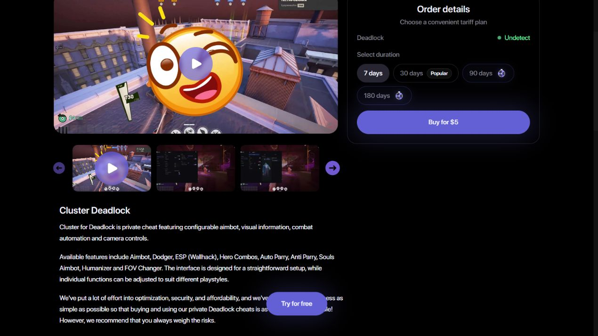
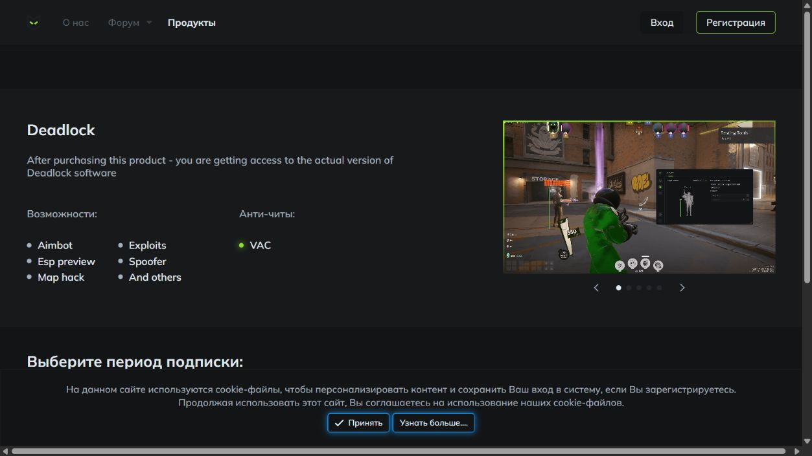
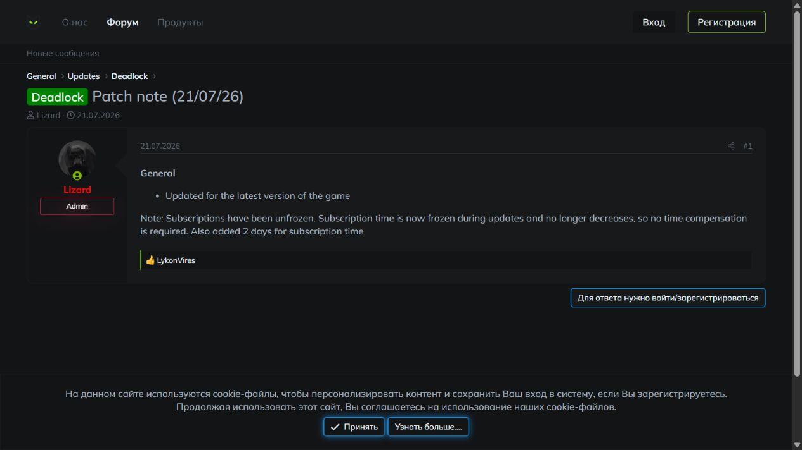

# Cluster vs Predator Deadlock: What Can Be Verified?

*Published and evidence checked: September 8, 2026 · By the CheatsGaming Editorial Team*

Absence of accessible evidence is not evidence that a product has failed. It is still a buying constraint.

That rule matters in this **Cluster vs Predator Deadlock** comparison. Cluster's official page loaded through a normal browser and a basic web request. Predator's product page and update forum loaded in a normal browser, while an automated request returned HTTP 403. None of those signals proves performance, safety, or current compatibility.

> **Editorial disclosure:** Cluster is the linked product in this article. We apply the same evidence labels to both vendors. We did not buy a subscription, complete checkout, run either product, test support response quality, or make a detection claim.

> **Quick answer:** Cluster exposes more pre-account detail in one stable product page: categories, duration choices, requirements, trial terms, risk language, and a support route. Predator has a browser-visible product page and dated official update forum, but its latest visible Deadlock note was from July 21, 2026 and contained little detail. That makes Predator available to research, not current enough to verify without another live check.

## What “verified” means in this comparison

“Verified” is often stretched until it means “a vendor wrote it somewhere.” We use three narrower layers.

- **Search-visible:** a result, snippet, or indexed URL exists. This is useful for discovery but weak for current status because snippets can be stale.
- **Browser-verified:** the official page loaded in a normal browser and the stated item was visible on September 8, 2026. This confirms public presentation, not live operation.
- **Checkout-verified:** a real account or purchase flow confirmed the current plan, total, entitlement, and terms. We did not reach this layer for either provider.

Our confidence labels follow those layers. **High confidence** means a stable fact was directly observed on an official page, such as a reachable support link or displayed system requirement. **Medium confidence** means a current official claim was visible but not independently tested, such as trial access or cloud behavior. **Low confidence** means the only support is an old announcement, a search snippet, an ambiguous control, or a page state that changed while rendering. The label measures evidence quality for this article; it is not a verdict on product quality, account risk, or future availability.

<!-- IMAGE_PLACEMENT: Place the timestamped Cluster product-page screenshot after the verification method. Type: real screenshot. Source: official Cluster Deadlock page, captured 2026-09-08. Alt: Cluster Deadlock official product page checked on September 8 2026. -->

## Cluster evidence available without an account

Cluster's English Deadlock product page returned normally and identified itself with a matching canonical URL. Without signing in, a reader could see named categories covering aim, visual information, hero combos, parry-related assistance, souls, field-of-view controls, and movement-related tools. The page also displayed 7-, 30-, 90-, and 180-day duration choices.

The same page stated Windows 10 or 11, 64-bit, with Intel or AMD support. It described a three-day trial for eligible new accounts, linked Telegram support, and told readers to weigh the risks.

Cluster's live [deadlock cheat](https://cluster.center/en/deadlock) page can be checked without relying on a reseller summary, but its vendor claims still need to be labelled as such.

Evidence labels for the Cluster block:

- **High confidence:** the official page loaded, the canonical matched, and the categories, requirements, duration choices, support route, and risk notice were visible.
- **Medium confidence:** the trial eligibility statement is current vendor language, but activation, included scope, and clock behavior were not tested.
- **Low confidence:** current in-game compatibility. A live product page is not a dated compatibility record, and no recent public Deadlock changelog was found during this check.

That last point is the important limit. Cluster makes the initial research easy, yet a reader still needs date-sensitive evidence after a major Deadlock patch. Public page reachability cannot fill that gap.

## Predator evidence and the access limitation

Predator needs a more careful description than “accessible” or “blocked.” A basic automated request to its official Deadlock product URL received HTTP 403. In a normal in-app browser, the same official product page loaded and showed a Deadlock listing, a small set of feature categories, and a subscription selector. The unselected selector displayed a zero value, so copying a price from that state would be misleading.

Predator's official update forum also loaded in the normal browser. The latest visible Deadlock-specific entry was titled “Patch note (21/07/26)” and dated July 21, 2026. Its public text said the product had been updated for the latest game version and referred to subscription-time handling. That is a dated first-party status signal, but it is brief and predates this September 8 check by seven weeks.

<!-- IMAGE_PLACEMENT: Place the normal-browser Predator product screenshot here. Type: real screenshot. Source: official Predator Deadlock page, captured 2026-09-08. Alt: Predator Deadlock official product page loaded in a normal browser on September 8 2026. -->

<!-- IMAGE_PLACEMENT: Place the dated Predator update screenshot directly after the product-page capture. Type: real screenshot. Source: official Predator update forum, captured 2026-09-08. Alt: Predator official Deadlock patch note dated July 21 2026. -->

Evidence labels for the Predator block:

- **High confidence:** the official product page and forum loaded in a normal browser on the check date; the July 21 entry and its date were visible.
- **Medium confidence:** Predator publicly presents a current Deadlock product and a subscription interface, but the purchase flow was not completed.
- **Low confidence:** September compatibility, current support responsiveness, and any old feature announcement not repeated on the live page.

The 403 is an access-method limitation. The evidence does not establish its cause, and it must not be translated into “offline,” “abandoned,” “inferior,” or “unsafe.” The fair response is a normal-browser recheck, followed by checkout and support checks before purchase.

## Features that can be compared at category level

This section stays short on purpose. Neither public page can prove how a category behaves in the live game.

Cluster publishes a broader named menu covering aim, ESP-style visual information, hero combos, parry assistance, souls, wider-view controls, and movement-related functions. Predator's live page showed a smaller collection of combat and visual categories alongside its subscription selector.

That difference supports one modest conclusion: Cluster offers more category-level information before sign-in. It does not prove that Cluster has more working functions, that Predator lacks anything shown elsewhere, or that either product performs better. Old forum posts and search snippets should not be used to bulk up Predator's current list; if a function matters, require it on the present product page, in current documentation, or in a fresh answer from support.

## Questions that remain unanswered

For Cluster, the largest open question is freshness. The product page is detailed but does not provide a recent dated Deadlock update trail. Ask what date the current build was checked against, where service interruptions are announced, what the trial includes, and whether subscription time is handled during downtime.

For Predator, the July 21 note is dated but thin. Ask whether the page's current Deadlock listing corresponds to a currently available entitlement, when compatibility was last confirmed after July 21, where system requirements are published, what support route applies before purchase, and what the final checkout total and terms are.

Both vendors leave the hardest questions outside the public page:

- What is the latest game build against which the current product was checked?
- Is there a public status or incident page?
- How are updates and interruptions timestamped?
- Which trial or refund conditions apply now?
- What data is collected by the site, account flow, and software?
- Which claims are measured independently rather than asserted by the vendor?

A support reply can reduce uncertainty, but only if it is specific and dated. “Works now” is weaker than a response that names the check date, the affected product, and where future status changes will appear.

## Who should postpone the decision

Postpone if you cannot access the official product and support pages yourself. A reseller summary or cached snippet is not enough for a current purchase.

Also postpone after a major game patch if neither vendor provides a fresh, dated status signal. Waiting is especially sensible when you rely on a trial, cannot tolerate downtime, or cannot resolve billing through the displayed support route.

Predator deserves a browser check rather than a verdict based on the automated 403. Cluster deserves a freshness check rather than a verdict based only on its detailed page. In both cases, stop if the live checkout contradicts the public product page, shows an unclear total, or withholds material terms until after payment.

## Conditional verdict with confidence labels

For the easiest pre-account research, **Cluster leads with high confidence**: its official page exposed a fuller set of decision facts and loaded consistently through both checked access methods. For current operational status, **Cluster remains low confidence** until it publishes or supplies a recent dated Deadlock update.

For browser-visible availability, **Predator is medium confidence**: the official product and update pages loaded normally even though automated access returned 403. For September compatibility, **Predator is low confidence** because the latest visible Deadlock note was July 21 and did not supply enough detail to bridge the date gap.

Choose Cluster if a compact, publicly described package and visible pre-account requirements reduce your research burden, then verify freshness with support. Keep Predator on the shortlist only if you can repeat the normal-browser check, confirm current terms in checkout, and obtain a newer dated status answer.

## FAQ

### Is Predator Deadlock still available?

Predator's official Deadlock product page loaded in a normal browser on September 8, 2026, so it was publicly presented as available for research. We did not complete checkout or test the product, and the latest visible Deadlock update note was dated July 21, 2026.

### Does a 403 response mean a product is offline?

No. In this check, an automated request returned 403 while a normal browser loaded the same official Predator page. A 403 proves that one request method was refused; it does not by itself establish downtime, product status, or the reason for refusal.

### What Cluster information is public?

Cluster publicly shows its Deadlock category list, duration choices, system requirements, eligible-new-account trial language, Telegram support route, and risk notice. Those are page facts and vendor claims, not independent tests of live behavior.

### How should old feature announcements be treated?

Use them as historical evidence only. A named function should count as current only when it appears on the live product page, in current documentation, or in a fresh dated official response that clearly applies to today's product.

<!-- INTERNAL_LINK_SUGGESTIONS
- Link from the broader provider patch-evidence comparison with “Predator public-access check” as the anchor.
- Link to a buying-evidence guide about product pages, changelogs, status pages, and checkout verification.
- Link from the Cluster-versus-Octarine comparison where public proof depth is discussed.
-->
