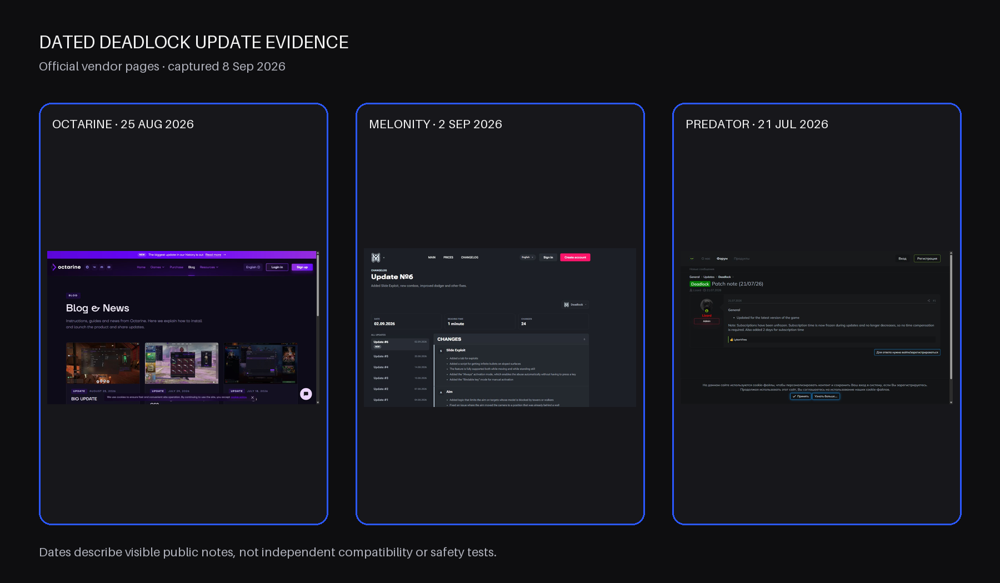
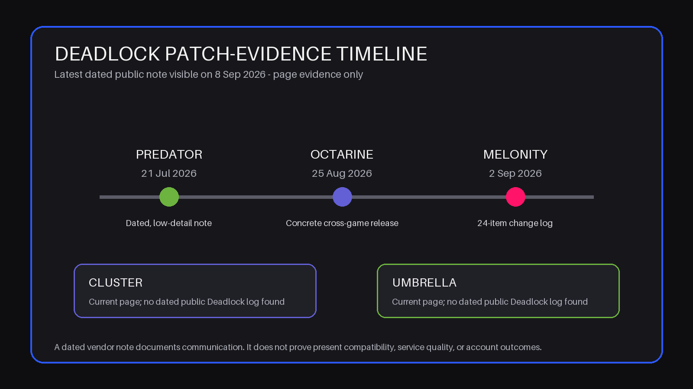

# Deadlock Cheat Providers Compared by Patch Evidence

*Published and evidence checked: September 8, 2026 · By the CheatsGaming Editorial Team*

Imagine two Deadlock reviews written six months apart. The first calls a provider current because its product page looks polished. The second calls the same provider stale because it cannot find a recent update note. Both conclusions may be reasonable for their dates, yet neither travels well unless the review records what was checked, when it was checked, and what remained unknown.

That is the problem with comparing **Deadlock cheat providers** by screenshots and feature counts alone. Deadlock changes, provider pages change, and commercial widgets can render differently from one visit to the next. A useful comparison needs a patch-evidence ledger: a dated trail that distinguishes a live page from a dated update, a support route from a tested response, and a vendor claim from an observed result.

> **Editorial disclosure:** Cluster is the linked product in this comparison. Cluster, Octarine, Umbrella, Melonity, and Predator were checked against the same public-evidence method. We did not buy, run, or detection-test any product; complete checkout; or test support quality. Public evidence cannot prove account safety or future compatibility.

> **Current snapshot:** Octarine and Melonity published the strongest recent dated change evidence found in this check. Cluster and Umbrella exposed useful current product pages but no recent public Deadlock changelog was found. Predator's official page and forum loaded in a normal browser, while automated access to its product page returned 403; its latest visible Deadlock note was dated July 21, 2026.

## Why Deadlock comparisons expire faster than ordinary reviews

An ordinary software review can sometimes survive months because its central workflow barely changes. A live-service game comparison is different. The game can change controls, heroes, UI behavior, and surrounding systems while an old vendor page stays indexed. Even a true statement can become useless when its check date disappears.

Feature count makes this worse. Twenty named functions do not produce twenty pieces of freshness evidence. A current product page confirms that the vendor is publicly presenting a product. A dated note confirms that the vendor said something changed on a particular day. Concrete notes reveal more than “updated,” but even detailed notes remain first-party statements until tested.

This article therefore does not rank raw feature volume, technical protection language, or community folklore. It compares five public trails as they appeared on September 8, 2026. A provider with thinner evidence is not automatically worse. It simply asks the buyer to carry more uncertainty into support and checkout.

## The patch-evidence method

Use the same six fields every time you revisit a provider:

- **Last checked:** the exact date and access route used.
- **Latest dated update:** the newest relevant first-party Deadlock entry you could actually open.
- **Product-page status:** whether the official page loaded and presented Deadlock as current.
- **Support status:** which official contact route was visible, without assuming response quality.
- **Visible limitation:** the most important weakness in the public trail.
- **Unresolved question:** one specific item to confirm before purchase or after a patch.

Evidence strength then falls into three practical levels. Directly observed stable page facts are high confidence. Current vendor statements that were visible but not tested are medium confidence. Old, vague, search-only, or rendering-dependent signals are low confidence. These levels describe the proof, not the product.

Give extra credit for a dated note that names concrete user-visible changes, and less credit for a note that only says the product was updated. Give no freshness credit for a long feature list, an undated badge, or a price that appears before a duration is selected. Finally, preserve access failures exactly: “automated request returned 403 but normal browser loaded” is evidence; “the provider is offline” would be an unsupported leap.

<!-- IMAGE_PLACEMENT: Place the real changelog-header collage after the method. Type: real screenshot collage. Sources: official Octarine, Melonity, and Predator pages, captured 2026-09-08. Alt: Dated public Deadlock update headers from Octarine Melonity and Predator. -->

## Cluster’s current public trail

### Evidence card: Cluster

Cluster's official English Deadlock page loaded with HTTP 200, rendered in a normal browser, and used a matching canonical URL. It exposed a game-specific category list, four duration choices, Windows 10/11 64-bit requirements for Intel or AMD, a three-day trial statement for eligible new accounts, a Telegram support route, and direct risk language.

Use Cluster's [deadlock cheat](https://cluster.center/en/deadlock) page as the current product snapshot, then compare its date-sensitive claims with any newer official announcement.

The page is strong at answering pre-account scope questions. It is weaker at proving freshness because no recent dated public Deadlock changelog was found during the check. A live page and a valid canonical are high-confidence publishing facts; the trial is a medium-confidence vendor claim; current compatibility remains low confidence without newer dated evidence.

Patch-evidence ledger:

- **Last checked:** September 8, 2026, by browser and direct web request.
- **Latest dated update:** no recent public Deadlock-specific changelog located.
- **Product-page status:** live, detailed, and canonically self-referencing.
- **Support status:** direct Telegram route visible; response quality untested.
- **Visible limitation:** product detail is not paired with a dated freshness trail.
- **Unresolved question:** when was the current Deadlock build last checked against the live game?

Cluster is the cleanest starting page in this group, but not the strongest public patch diary. That distinction is exactly why the ledger matters.

## Octarine and Melonity’s dated change logs

### Evidence card: Octarine

Octarine's official Deadlock page loaded and presented a game-specific product inside a broader multi-game platform. It named cloud configurations, shared profiles, documentation, a blog, social routes, and an all-games subscription model. A public blog index showed “BIG UPDATE,” Update #88, dated August 25, 2026. The post described concrete interface, preview, theme, and notification changes and said Deadlock received the update first.

That is useful recent evidence because it has a date and visible change categories. It still does not prove every Deadlock function worked on September 8. Octarine's public pricing/access language also conflicted with a June guide, and the current numeric price rendering looked unreliable during the check, so no price belongs in a responsible comparison. The linked API documentation host also closed the browser connection during verification; the product page's docs claim is visible, but public readability was not confirmed.

Patch-evidence ledger:

- **Last checked:** September 8, 2026, in a normal browser.
- **Latest dated update:** Update #88, August 25, 2026.
- **Product-page status:** live, game-specific, and connected to a broader platform pitch.
- **Support status:** social and community routes visible; service quality untested.
- **Visible limitation:** commercial language conflicted across public pages, and API docs were not independently readable.
- **Unresolved question:** which current terms and documentation apply specifically to a new Deadlock account today?

Octarine has the strongest recent public update date in this comparison after Melonity, plus better-than-average detail. Its evidence is valuable precisely because the access and docs inconsistencies remain visible beside it.

### Evidence card: Melonity

Melonity's official Deadlock page loaded and presented the product as current. It linked support and trial information and stated Windows 10/11 requirements. Its public changelog route resolved to Update No. 6, dated September 2, 2026, with 24 listed changes. The note named multiple concrete user-visible additions and fixes rather than stopping at a generic status line.

That gives Melonity the newest visible dated Deadlock update found in this check. It is not proof of compatibility six days later, and the quantity “24” should not become a quality score. The value comes from the date, first-party location, and specificity. Telegram and VK support routes were visible, with stated service hours of 08:00–00:00 MSK; actual response time was not tested.

Patch-evidence ledger:

- **Last checked:** September 8, 2026, in a normal browser.
- **Latest dated update:** Update No. 6, September 2, 2026.
- **Product-page status:** live and presented as current.
- **Support status:** Telegram and VK routes plus stated hours visible; service untested.
- **Visible limitation:** first-party change detail still does not independently verify live behavior.
- **Unresolved question:** does Melonity publish a separate status signal when a new game patch interrupts availability?

Melonity leads this snapshot on recency and concrete note detail. That is a public-communication finding, not a safety ranking.

## Umbrella’s platform evidence

### Evidence card: Umbrella

Umbrella's official Deadlock page loaded and emphasized a different model: cloud configurations, custom scripts, an extensible API claim, aim and visual categories, combos, wider-view controls, a closed community, and a live-chat widget. It stated a seven-day new-user trial and 24/7 support. Those are current vendor claims visible on the page, not tested services.

The platform pitch makes documentation unusually important. During the check, the page's documentation control did not lead to a separately verified public docs route. No recent dated public Deadlock changelog was found. Its commercial section also briefly rendered unstable values while loading, so this article does not quote a price.

Patch-evidence ledger:

- **Last checked:** September 8, 2026, in a normal browser.
- **Latest dated update:** no recent public Deadlock-specific changelog located.
- **Product-page status:** live with cloud and extensibility claims.
- **Support status:** live-chat and community routes visible; 24/7 service claim untested.
- **Visible limitation:** platform claims lack a separately verified versioned docs and update trail.
- **Unresolved question:** where are current API, cloud-recovery, and game-version changes documented publicly?

Umbrella offers more public platform vocabulary than Cluster, but less dated patch proof than Octarine or Melonity. Readers who value extensibility should require more documentation, not fewer questions.

## Predator’s public-access limitation

### Evidence card: Predator

Predator's evidence trail splits by access method. Automated access to the official Deadlock product URL returned HTTP 403. A normal browser loaded the product page, showing a Deadlock listing, a compact category set, and a subscription selector. The official update forum also loaded.

The latest visible Deadlock entry was “Patch note (21/07/26),” dated July 21, 2026. Its text said the product was updated for the latest game version and mentioned subscription-time handling. The date is useful; the detail is limited; and the note cannot establish September 8 compatibility. The unselected product selector also showed a zero value, so it would be irresponsible to treat that as a real price.

Patch-evidence ledger:

- **Last checked:** September 8, 2026, by automated request and normal browser.
- **Latest dated update:** July 21, 2026.
- **Product-page status:** browser-visible; automated request refused with 403.
- **Support status:** official forum visible; current response quality not tested.
- **Visible limitation:** newest visible Deadlock note is older and low-detail.
- **Unresolved question:** what newer dated proof connects the current listing to the September game state?

Predator should not be called offline, abandoned, unsafe, or inferior because one access method was refused. It should be called harder to verify automatically and in need of a fresh browser, checkout, and support check.

## A provider-by-provider freshness verdict

The five cards do not produce a universal winner. They produce five different research burdens.

- **Melonity — strongest recent dated trail:** the September 2 note was the newest found and named concrete user-visible changes. Current compatibility and service quality remain untested.
- **Octarine — strong recent platform trail:** the August 25 post was dated and specific, but current commercial language conflicted across public material and linked API docs were not independently verified.
- **Cluster — strongest compact product snapshot:** the live page answered more basic pre-account questions cleanly, including requirements, trial language, support, and risk. A recent dated Deadlock changelog was the missing piece.
- **Umbrella — broad platform claims, thin dated trail:** cloud, community, scripting, and API language were visible. Public versioning, documentation, and recent Deadlock update proof need a direct recheck.
- **Predator — browser-visible with an older brief note:** the product and forum loaded normally, despite automated 403. The July 21 entry is dated evidence, but it is too old and terse to settle September freshness.

This ordering is about public patch evidence on one date. It is not a detection ranking, performance test, or prediction. A new official post tomorrow could reorder it immediately.

<!-- IMAGE_PLACEMENT: Place the hand-built public-update timeline after the five-card verdict. Type: hand-built editorial graphic based on verified dates; no generated art. Alt: Timeline of latest visible public Deadlock updates checked September 8 2026. -->

## What to recheck after the next major patch

Save the six-field ledger and run it again instead of rereading this conclusion. Start with the official product URL. Record whether it loads, whether its canonical still matches, and whether the page changes its status language. Then find the newest dated Deadlock note and record exactly how specific it is.

Next, open the public support and documentation routes. Look for a timestamped status statement, new requirements, changed trial terms, or a contradiction between the product page and account flow. Do not infer a total from an unselected purchase widget. If you proceed to checkout, record the selected duration, final total, entitlement, renewal terms, and refund language without sharing personal data.

Recheck these questions for every provider:

- Does the latest dated note come after the game patch?
- Does it name concrete user-visible changes or only say “updated”?
- Does the current product page agree with the changelog and docs?
- Is there a visible support route for pre-purchase questions?
- Are outages or interrupted subscription time explained publicly?
- Which important claim remains a vendor statement rather than an observed result?

Public evidence has a short half-life. Stamp the new findings with an exact date, preserve contradictory signals, and let “unknown” remain unknown.

## FAQ

### Which Deadlock providers publish changelogs?

During this check, Octarine, Melonity, and Predator exposed dated first-party update material. Melonity's newest visible note was September 2, Octarine's was August 25, and Predator's was July 21, 2026. No recent public Deadlock-specific changelog was found for Cluster or Umbrella.

### How quickly does a Deadlock cheat review become outdated?

Potentially after the next meaningful game or vendor update. A comparison should display its evidence-check date and be treated as a snapshot, especially when its conclusion depends on current status, requirements, trial terms, or update notes.

### Is a current product page enough proof of compatibility?

No. It proves that the vendor currently presents the product publicly. Compatibility needs fresher, date-sensitive evidence, and even a current official note remains a vendor statement unless independently tested.

### What should be rechecked after a game patch?

Reopen the official product page, changelog, documentation, status channel, support route, and current checkout terms. Compare the newest dated note with the patch date and record unresolved questions instead of filling gaps with old announcements.

### Can patch notes prove that a product is safe?

No. Patch notes document what a vendor says changed and when. They cannot prove account safety, future behavior, support quality, or the absence of risk.

**Current finding:** Melonity and Octarine provide the strongest recent dated public change evidence in this September 8 snapshot, while Cluster provides the clearest compact product-page evidence. **Unresolved issue:** none of the five public trails independently proves present compatibility or account safety. **Recheck date:** September 15, 2026.

<!-- INTERNAL_LINK_SUGGESTIONS
- Link from each two-provider comparison with “compare the dated patch trail” as the contextual anchor.
- Link from a Deadlock update article whenever its publication date supersedes this snapshot.
- Link to a neutral pre-purchase evidence checklist covering product, support, docs, status, and checkout.
-->
